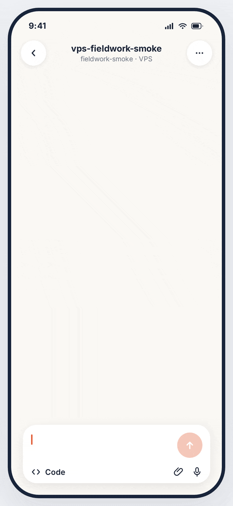

# demoframe

Template-driven demo GIF/MP4 generator for READMEs and launch posts. Compose
scenes inside device frames in a small YAML config; demoframe renders them
deterministically in Chromium at high resolution, downscales cleanly, and
encodes a tight, looping GIF (or MP4) with a QA report.

<p align="center">
  
</p>

The hero above is demoframe's own output: `examples/fieldwork-hero/demo.yml`,
439KB, 480px, 15fps, loops forever.

## Why

Hand-crafting README demos means fighting screen recorders, fonts, GIF
palettes, and file size limits every single time. demoframe replaces that
with a deterministic pipeline: config in, designed-looking pixels out, same
result on every machine with the pinned renderer.

No AI calls, no uploads: everything renders locally. The config format is
designed so your coding agent can write it for you (see `docs/llms.txt` and
`schema/demoframe.schema.json`).

## Install

```sh
npm install -g demoframe
demoframe install-browser   # one-time Chromium download (~150MB)
demoframe doctor            # verify the environment
```

ffmpeg ships with the package. For best GIF quality also install
[gifski](https://gif.ski) (`brew install gifski`); demoframe uses it
automatically when present and falls back to ffmpeg otherwise.

## Quick start

```sh
demoframe init my-demo --frame phone
cd my-demo
demoframe check demo.yml      # validate config, assets, privacy scan
demoframe preview demo.yml    # key stills + README-size + dark/light composites
demoframe render demo.yml     # frames -> GIF/MP4 + report.json
demoframe serve demo.yml      # live preview with a time scrubber
```

## Config

```yaml
title: Fieldwork mobile to pull request demo
output: { format: gif, width: 480, fps: 15, budget: 5MB, displayWidth: 280 }
theme: { accent: "#e2603a", mode: light, font: inter }
frame: { type: phone, title: vps-fieldwork-smoke, subtitle: "fieldwork-smoke · VPS" }
scenes:
  - type: typing
    duration: 3.8
    text: "Add a tiny release-notes helper with a basic test"
    send: true
  - type: steps
    duration: 3.6
    header: { title: Workspace ready, detail: "VPS connected." }
    items:
      - { label: Verification passed, detail: "+3 -0", state: done }
      - { label: Opening pull request, state: active }
  - type: status-card
    duration: 3.0
    transition: crossfade
    title: Add release notes helper
    checks: [Checks passed, Ready for review]
    cta: { label: Merge pull request, style: success }
  - type: hold
    duration: 1.4
```

**Frames**: `phone`, `browser`, `terminal`.

**Scenes**: `typing` (animated typing with caret), `steps` (progress rows with
done/active/pending states), `status-card` (PR-style result screen with checks
and a CTA), `screenshot` (your image with optional pan/zoom), `hold` (freeze
the previous scene).

**Transitions**: `cut` (default) and `crossfade`. Crossfades inflate GIF
palettes; prefer cuts when size matters.

**Theme**: accent color, light/dark mode, bundled Inter + JetBrains Mono
fonts (pixel-stable across machines), optional background override.

JSON configs are accepted too. Validate anything against
`schema/demoframe.schema.json`.

## Size budget

GIFs default to a 5MB budget (GitHub renders README GIFs poorly past that).
If an encode exceeds the budget, demoframe automatically retries down a
ladder (15fps to 12fps, then 480px to 400px) and reports what it did. Every
render ends with a QA report (dimensions, duration, fps, frame count, size,
loop marker, audio absence), printed and written to `report.json`.

## Privacy

`check` warns when config text or asset filenames contain things that look
like emails, credentials, URLs, or private hosts, since they would be baked
into a published asset. Screenshots are normalized with EXIF/GPS metadata
stripped. Use `--strict` in CI to fail on warnings. Still: review your own
screenshots before publishing.

## For coding agents

demoframe is built to be driven by agents: `check` validates in milliseconds
with precise paths and hints, `render` writes machine-readable `report.json`,
and `docs/llms.txt` documents the full contract. Point your agent at a
screenshot of your product and ask it to write the demo config.

## Determinism

Rendering is deterministic within a pinned renderer environment: all
animation is a pure function of the timeline (no free-running animations),
fonts are bundled, and the Chromium version is pinned by the lockfile. Don't
expect byte-identical output across different machines or Chromium builds;
golden tests compare with a small pixel threshold.

## License

MIT. Bundled fonts are OFL; ffmpeg-static is GPL (invoked as a separate
process). See THIRD_PARTY_LICENSES.md.
